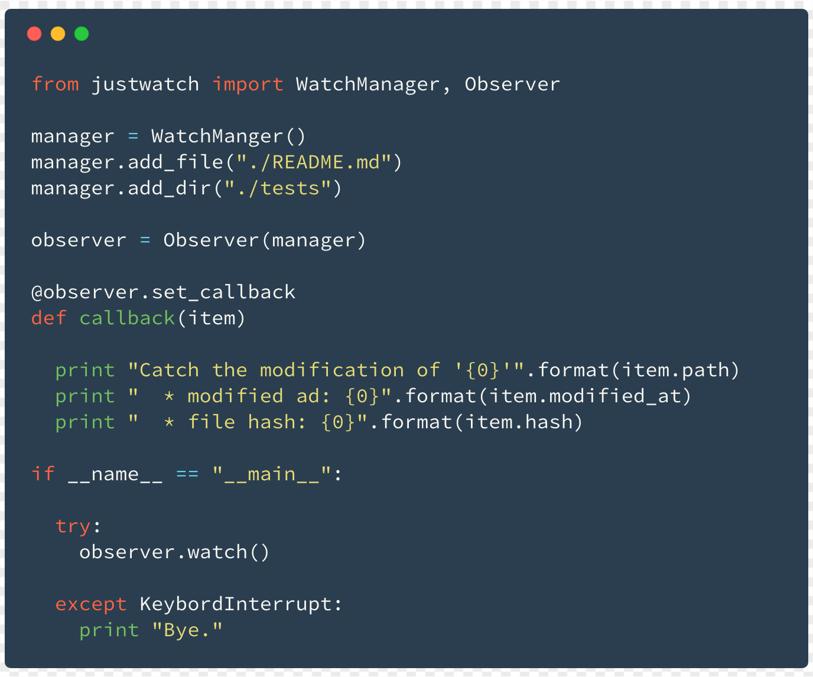

# JustWatch

[](http://forthebadge.com)

[](https://travis-ci.org/alice1017/JustWatch)
[](https://coveralls.io/github/alice1017/JustWatch)

[](https://asciinema.org/a/175956)

## :page_facing_up: Overview

Python utility to watch the **file modification**.
There are similar libraries: [pyinotify](https://github.com/seb-m/pyinotify), [watchdog](https://github.com/gorakhargosh/watchdog).
These libraries watch the file system event, but JustWatch is supported modification **only**.

## :pencil2: Usage

### quick start

First of all, import classes from `justwatch`:

```py
from justwatch import WatchManager, Observer
```

make `WatchManager` instance and add file or directory:

```py
manager = WatchManager()
manager.add_file("./README.md")
manager.add_dir("./tests")
```

make `Observer` instance and set callback:

```py
observer = Observer(manager)

@observer.set_callback
def callback(item):
    print "Catch the modification of '{0}'".format(item.path)
```

and run `observer.watch`

```py
observer.watch()
```

### example



## :inbox_tray: Installation

```
$ git clone git@github.com:alice1017/JustWatch.git
$ cd JustWatch
$ python setup.py build install
```

or

```
$ pip install just-watch
```

## :eyes: Contribution

1. Forks on [Github](https://github.com/alice1017/JustWatch)
2. Find a bug? Send a pull request to get it merged and published.
